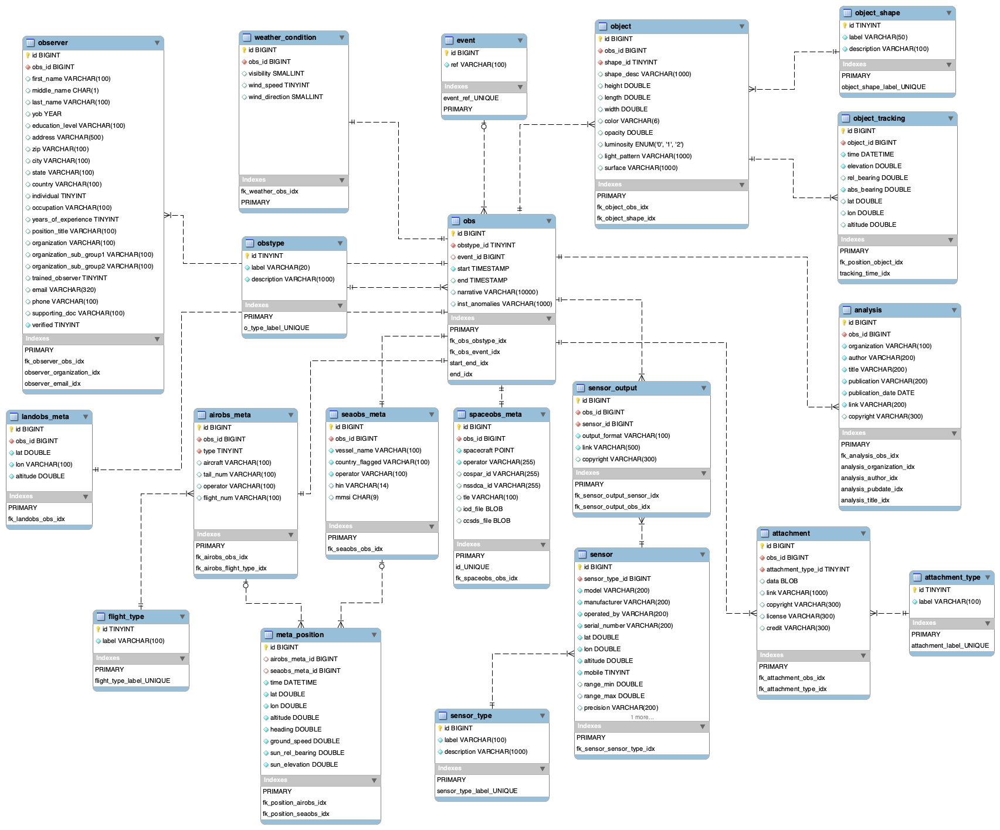

# adx-ds

**ADX-DW** ([ADX Data Warehouse](https://adxproject.org/adx-dw)) is the official implementation of the 
**ADX-DS** ([ADX Data Standards](https://adxproject.org/adx-ds)) maintained by the ADX project.

The ADX Data Standards is an Open Source database schema which aims to normalize the way we report observations of 
anomalous phenomena.

Join the project at [The ADX Project](https://adxproject.org/).